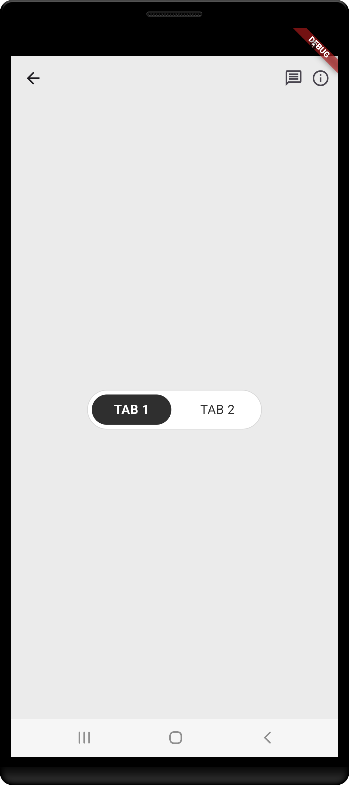
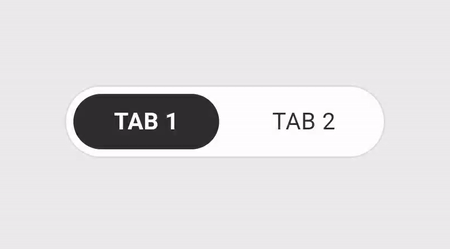

# tab_bar_widget

A customizable tab bar widget with animation made by Umang Pipaliya.

## Features

- Animated tab indicator
- Customizable styles and decorations
- Easy integration with GetX state management

## Screenshots



## Demo



## Installation

Add the package to your `pubspec.yaml`:

```yaml
dependencies:
  tab_bar_widget: ^0.0.1

```dart
import 'package:flutter/material.dart';
import 'package:tab_bar_widget/tab_bar_widget.dart';

class MyHomePage extends StatelessWidget {
  @override
  Widget build(BuildContext context) {
    return Scaffold(
      appBar: AppBar(title: Text('Tab Bar Example')),
      body: Center(
        child: TabBarWidget(
          firstTab: 'Tab 1',
          secondTab: 'Tab 2',
          onTabChanged: (int index) {
            print('Selected tab: $index');
          },
        ),
      ),
    );
  }
}


## License

This project is licensed under the MIT License - see the [LICENSE](LICENSE) file for details.


